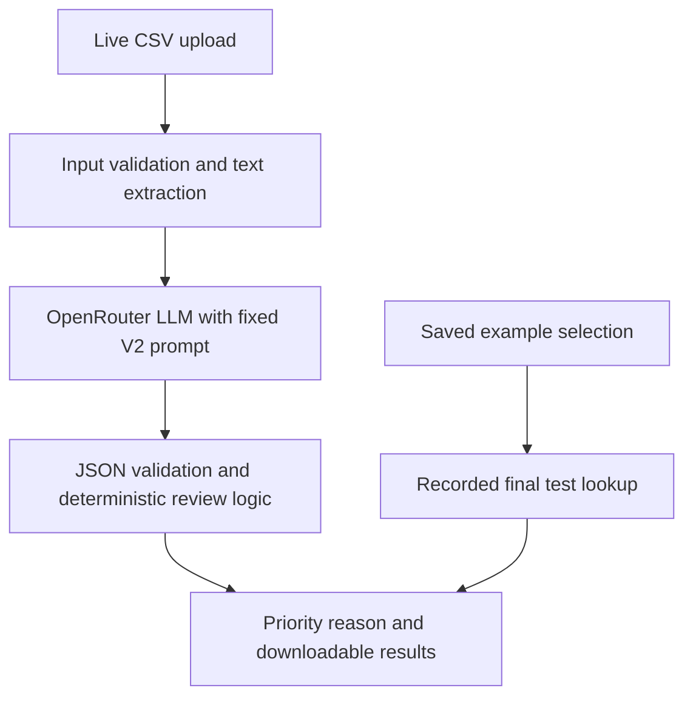
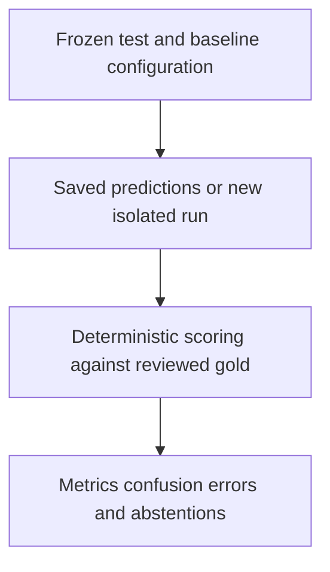

# Product documentation

## Persona and value

The primary user is a bank or payment-service customer-support shift supervisor who triages complaint text before manual investigation. They need an understandable proposed priority and reason, particularly to avoid delaying unresolved security incidents. This prototype offers a consistent first pass; no operational time saving, loss reduction or service-level improvement has been measured.

The proposed persona "Siti" in the initial proposal is illustrative, not an interviewed bank employee. Initial workload and delay figures were scenario assumptions, not verified bank measurements.

## Input

Live input is a CSV with `ticket_id,text`, a `text`-only CSV or the CFPB complaint ID/narrative columns. The application validates encoding, nonempty narratives, unique IDs and batch limits. Only narrative text is supplied to the external model. Gold labels, review evidence and other columns are excluded.

The single-ticket page selects one of four stored demonstration narratives; it is a saved-result viewer and makes no live request. No direct connection to an email inbox or bank ticket system is implemented.

## Output

| Field | Meaning |
|---|---|
| `raw_priority` | Tentative High, Medium or Low from a valid model response |
| `final_priority` | High, Medium, Low or Escalate after application checks |
| `confidence` | Model self-reported certainty; not a calibrated probability |
| `reason` | Short explanation grounded in the narrative |
| `information_sufficient` | Whether the response declares enough evidence to classify |
| `review_trigger`, `status` | Application explanation of review or valid processing |
| Model, provider, prompt, request, latency and usage fields | Provenance and recorded telemetry when returned by the service |

Batch outputs download as CSV and JSON. If a network/API request fails, the batch pauses and preserves completed predictions; it does not fabricate a class for the failed ticket.

## Architecture

The runtime imports the evaluated `ticket_router.py` unchanged. Confidence below 0.80, insufficient information, refusal or invalid output produces Escalate. The application decides escalation; the model supplies a tentative H/M/L class. Prompts treat ticket instructions as untrusted text. No RAG, autonomous agent, vector store or banking transaction tool is involved.

Formal evaluation is a separate path:

The app reads submitted final metrics; live jobs write to `demo_runs/`. Fresh formal runs write to `reruns/`. They cannot replace displayed submitted scores through the supplied final runner.

## Policy

The annotation intent is in `data/ANNOTATION_RULES.md`; the actual frozen model prompt is in `prompts/v2.txt`. High focuses on explicit unresolved security or scam allegations. Medium covers other concrete unresolved service/billing problems. Low covers general feedback, enquiries or fully resolved incidents. Anger, financial hardship and amount alone do not establish High.

The human policy includes unauthorized account opening/identity misuse; frozen V2 does not explicitly cover these without a stated transaction. This is a documented implementation gap, not silently repaired in the submitted evaluated classifier.

## Metrics targeted and reached

| Measure | Target or evaluation intent | Actual final result |
|---|---|---|
| Macro-F1 | Original proposal target ≥0.80 | 0.8028; narrowly reached |
| High recall | Protect High tickets and compare with both frozen baselines; no new numerical target introduced | 91.67% (55/60), versus keyword 76.67% and majority 0% |
| Accuracy | Supporting whole-set metric | 94.50% (189/200) |
| High-or-Escalate recall | Report separately from correct High assignment | 91.67% |
| Abstention rate | Transparently report how often review is requested | 0.50% (1/200) |
| Wrong raw among abstained | Assess whether abstention catches likely errors | 0/1 = 0%; no raw errors caught |
| Cost and latency | Observe actual final-run inference telemetry | USD 0.03415455 total; 1.17419 seconds mean request latency |

No measured business ROI, time-saving target achievement or production prevalence claim is made. The selected holdout has 60 High, 138 Medium and two Low. Labels originated as AI suggestions and were manually reviewed and accepted unchanged by one reviewer before final inference.

## Rough edges and future path

Five High tickets were routed Medium. Ten raw mistakes were assigned confidence 0.85–0.95 and never escalated, so the confidence rule is not a validated safety guarantee. Low has only two examples. Annotation anchoring, selected class proportions, ambiguity exclusions, US-to-Singapore domain differences and changing upstream model routing constrain interpretation.

Next work should obtain independent labels and more Low/ambiguous examples, refine identity-theft evidence handling on new development data, calibrate uncertainty and evaluate on a fresh holdout. A monitored pilot should measure supervisor review time, urgent-ticket delay and unnecessary escalation workload. Bank integration would require privacy and processing review; the present UI is a CSV prototype with human decision responsibility.
